# Audile, Music Recognition App

Audile is a fully open-source Android application that identifies music playing around you in real time. Point your phone at any audio source, tap recognize, and within seconds you'll have the full track details from artist to album, release year, artwork, lyrics, and direct links to stream it on your preferred platform.

The app is built entirely with modern Android development practices like Jetpack Compose, clean architecture, and a multi-module Gradle setup  making it a strong reference for production-quality Android development.

---

## Features

### Music Recognition
Audile supports three recognition backends: [AudD](https://audd.io/), [ACRCloud](https://www.acrcloud.com/), and [Shazam](https://www.shazam.com/company/), giving you flexibility and redundancy. If there is no internet connection at the time of recognition, the app saves the audio recording and automatically retries when connectivity is restored.

### Track Library
Every recognized track is saved to your personal library. You can filter by date, sort by artist or title, mark tracks as favorites, and search across your entire history. Tracks can be deleted individually or in bulk.

### Lyrics
Full lyrics are fetched and displayed for recognized tracks. Synced (time-stamped) lyrics are supported where available, so you can follow along in real time.

### Streaming Links
Using [Odesli](https://odesli.co/), Audile automatically retrieves links to the recognized track across all major music platforms including Spotify, Apple Music, YouTube Music, Deezer, and more.

### Share as Story Card
Share any recognized track as a beautifully designed story card that is perfect for Instagram, WhatsApp, or any social platform. The card is generated directly on-device and includes the track artwork, title, and artist.

### Personal Stats
A dedicated stats screen gives you an overview of your recognition history. See your most recognized artists, discover patterns in when and how often you use the app, and get a snapshot of your overall music taste.

### Concert Finder
Discover upcoming live concerts for any recognized artist. Powered by the [Ticketmaster API](https://developer.ticketmaster.com/), the Concert Finder shows you event names, dates, venues, and cities. Tap any result to open the official ticket purchase page directly in your browser.

### Background Usage
Audile works seamlessly in the background. Trigger recognition from the notification drawer, a home screen widget, or a quick settings tile  without ever opening the app.

### Light & Dark Theme
Audile supports both light and dark themes with a rich, vibrant color palette. You can set the theme manually or let it follow your system settings automatically, so the app switches between light and dark based on the time of day or your device's display mode.

### Preferences
A comprehensive settings screen lets you configure recognition behavior, choose your preferred backend, set what happens on failed recognitions, toggle dynamic color, control the notification service, and more.

---

## Screenshots

### Light Theme

| Home | Track Details | Lyrics |
|---|---|---|
| 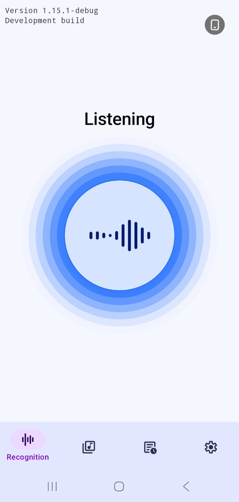 | 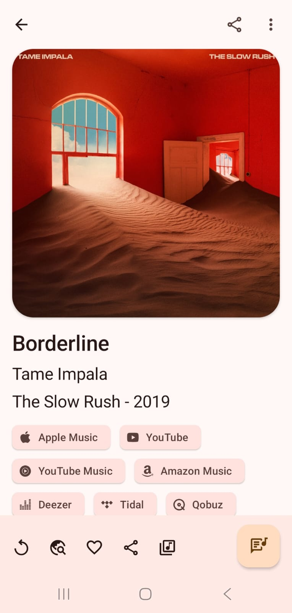 | 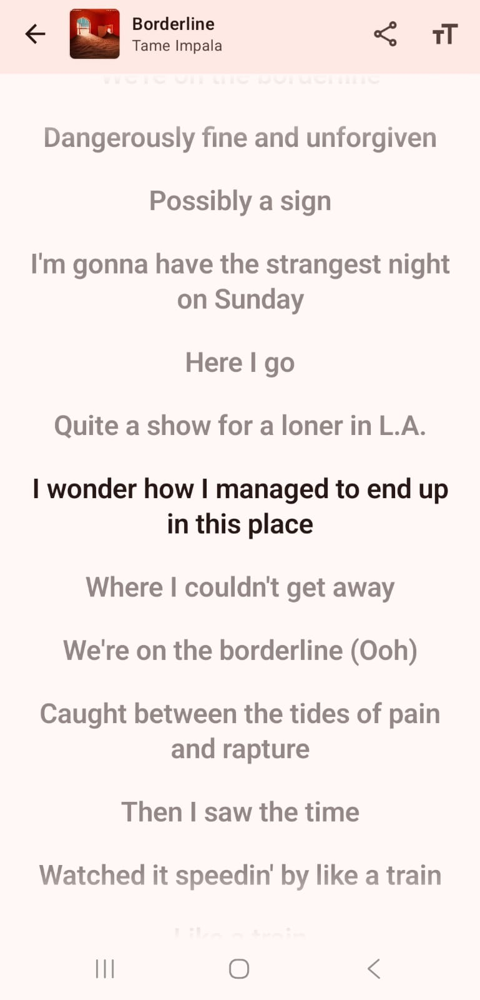 |

| Concert Finder | Library | Web Search |
|---|---|---|
| 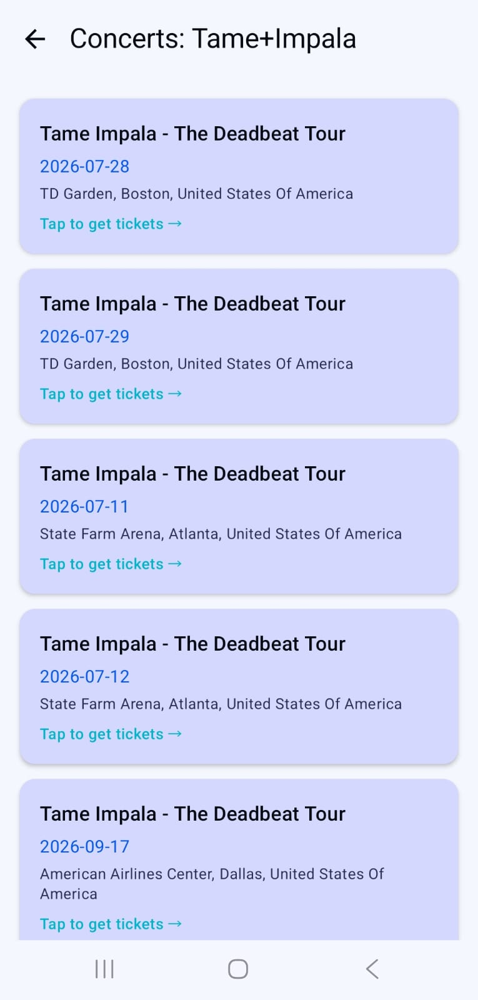 | 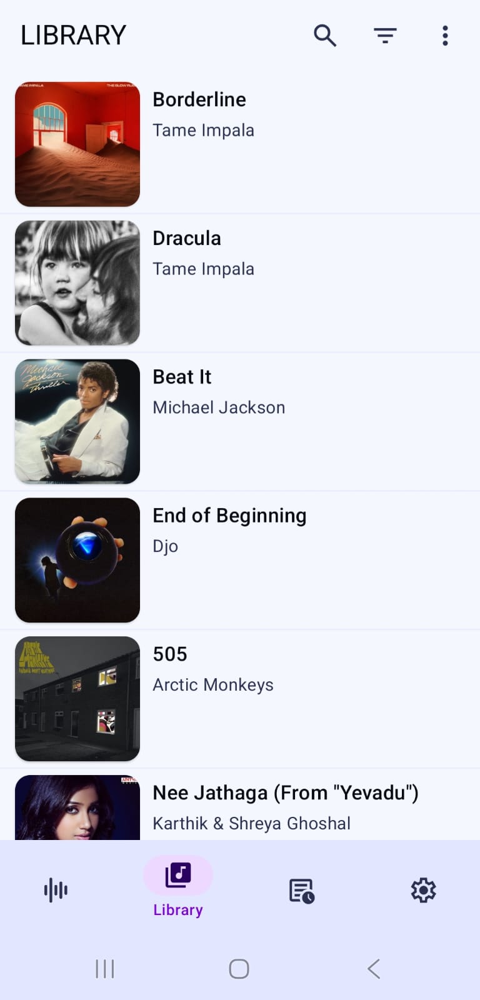 | 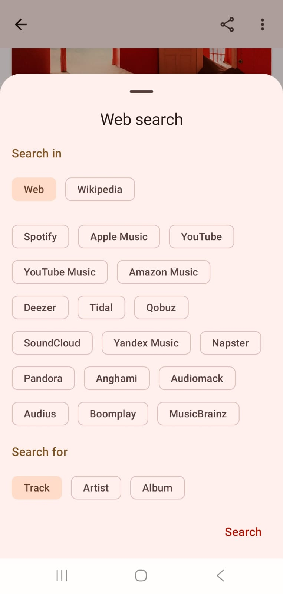 |

### Dark Theme

| Home | Track Details | Library |
|---|---|---|
| 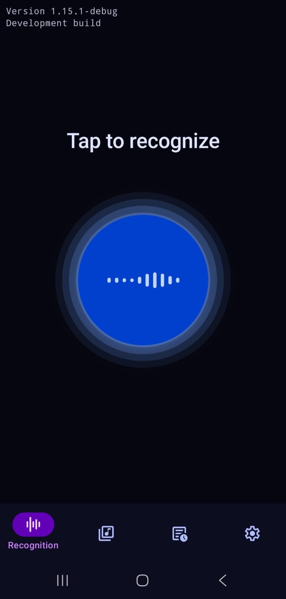 | 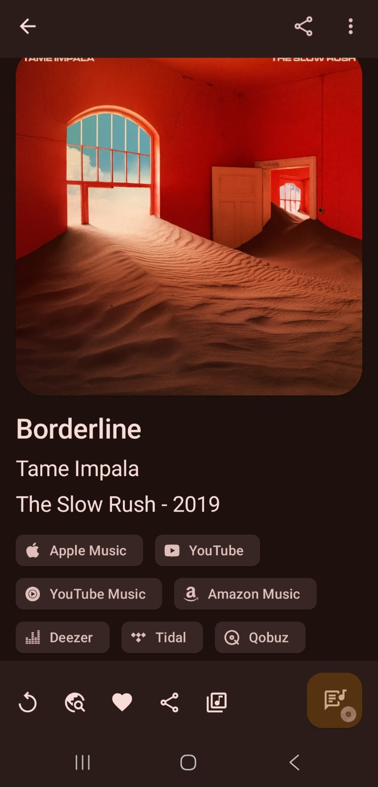 | 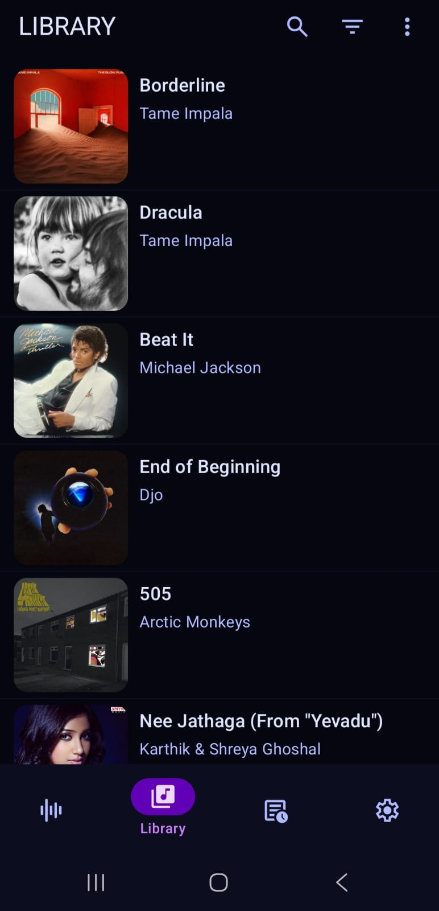 |

| Lyrics | Concert Finder | Story Card |
|---|---|---|
| 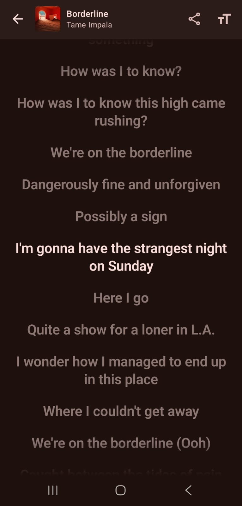 | 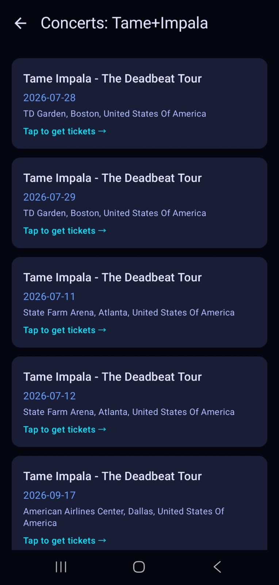 | 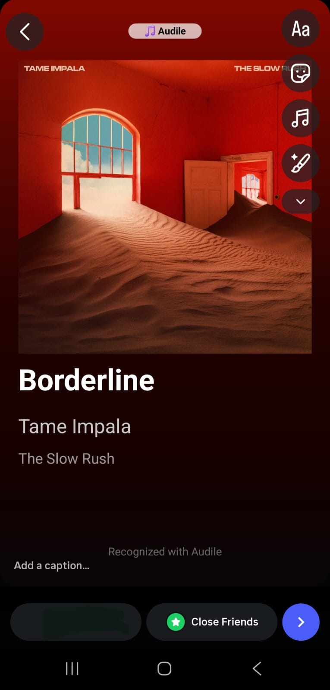 |

---

## Tech Stack

| Layer | Technology |
|---|---|
| Language | Kotlin |
| UI | Jetpack Compose + Material 3 |
| Architecture | MVVM + Clean Architecture |
| Dependency Injection | Hilt |
| Networking | Ktor + OkHttp |
| Local Database | Room |
| Preferences Storage | DataStore (Proto) |
| Serialization | kotlinx.serialization |
| Image Loading | Coil |
| Concerts API | Ticketmaster Discovery API |
| Music Links | Odesli API |

---

## Architecture

The project follows a strict multi-module clean architecture:

```
app/                    → App entry point, navigation, DI wiring
core/
  domain/               → Business logic, repository interfaces, domain models
  data/                 → Repository implementations, API clients, mappers
  database/             → Room database, DAOs, entities
  datastore/            → Proto DataStore for user preferences
  network/              → Shared Ktor HTTP client, logging
  ui/                   → Shared Compose components, theme, colors
  common/               → Shared utilities, coroutine dispatchers
feature/
  recognition/          → Recognition screen and background service
  track/                → Track detail, lyrics, story card, concert finder button
  library/              → Library screen, search, stats
  concerts/             → Concert finder screen and Ticketmaster integration
  preferences/          → Settings screen
```

Each feature module depends only on `core/domain`, keeping business logic completely decoupled from the UI layer.

---

## API Keys

<details><summary>AudD</summary><p>

AudD is a paid service that requires an API token. If you don't have one, you can [sign up](https://dashboard.audd.io/) for a 14 day trial token.

You can also use the app without a token, but this will significantly restrict the number of daily recognitions. Please keep in mind that this behavior is not guaranteed by the service and can be restricted at any time.

</p></details>

<details><summary>ACRCloud</summary><p>

ACRCloud offers a free trial period and ongoing limited free usage for development. To use this service, create an account and register a project. Refer to this [guide](https://docs.acrcloud.com/tutorials/recognize-music/) for setup instructions.

Key steps:
- Select the geographical region closest to you to minimize latency.
- Set the audio source as `Recorded audio`.
- Set the audio engine to `Audio fingerprinting` for best accuracy.
- Check all boxes for 3rd party ID integration.

</p></details>

<details><summary>Ticketmaster (Concert Finder)</summary><p>

The Concert Finder feature requires a free Ticketmaster API key. Sign up at [developer.ticketmaster.com](https://developer.ticketmaster.com/) to get one.

Once you have your key, replace the value in:
`core/data/src/main/java/com/mrsep/musicrecognizer/core/data/concerts/ConcertRepositoryImpl.kt`

</p></details>

---

## Building from Source

Please see [BUILDING.md](https://github.com/aleksey-saenko/MusicRecognizer/blob/master/BUILDING.md) for detailed build instructions.

---

## Translation

Community translations are managed through [Weblate](https://hosted.weblate.org/engage/audile/). Contributions and corrections are welcome.

---

## Attribution

This project is based on [Audile](https://github.com/aleksey-saenko/MusicRecognizer) by Aleksey Saenko, used with permission.

Additional features like Share as Story Card, Personal Stats Page, and Concert Finder  were designed and developed by Smirta Pathak.

---

## License

```
Copyright (C) 2023-2026 Aleksey Saenko
Copyright (C) 2026 Smirta Pathak

This program is free software: you can redistribute it and/or modify
it under the terms of the GNU General Public License as published by
the Free Software Foundation, either version 3 of the License, or
(at your option) any later version.

This program is distributed in the hope that it will be useful,
but WITHOUT ANY WARRANTY; without even the implied warranty of
MERCHANTABILITY or FITNESS FOR A PARTICULAR PURPOSE. See the
GNU General Public License for more details.

You should have received a copy of the GNU General Public License
along with this program. If not, see <https://www.gnu.org/licenses/>.
```
